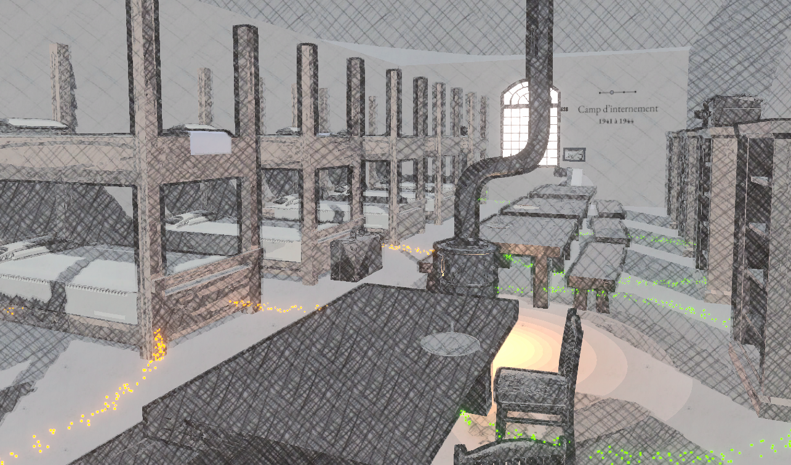
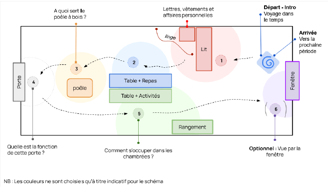
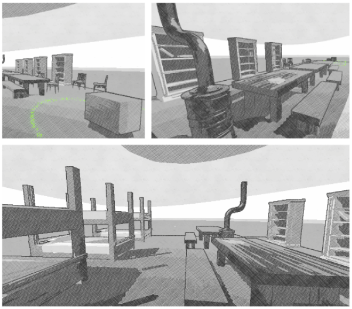
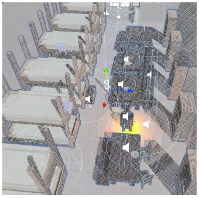

# TimeTravelProjectXR

*Winter 2023*

## Concept

The project *TimeTravel* was developed as part of a research project between our university *Université de Technologie de Compiègne* and the memorial of Compiègne. The idea was to reconstruct in 3D and XR the history of this place through a virtual visit that could allow the users to see the place evolve and change with time. During the winter semester of 2023, we were able to test different approaches and finally be able to create an experience including four periods: 
- 1914-1918: military hospital for the French army,
- 1941-1944: internment camp during German occupation,
- 1945-1997: casern for the French army,
- 2008-present: memorial.

> [!NOTE]  
> Being a project for a French memorial the experience is in French.

> [!NOTE]  
> Being a university project this experience is not 100% finished nor optimised. The historical information might not be always accurate, think of it as a POC more than a finished product.

> [!NOTE] 
> 3D version for PC: https://github.com/sfremann/TimeTravelProject

---

## Credits

- Sarah Frémann (https://github.com/sfremann) 
- Anaïs Bourguignon ()

  
Details

  ### Design & Writing
  
  - Scenario: Sarah Frémann & Anaïs Bourguignon
  - Dialogue: Sarah Frémann
  - Historical research: Sarah Frémann & Anaïs Bourguignon

  

  ### Programming & Engineering
  
  - Gameplay: Sarah Frémann
  - Environment behavior: Sarah Frémann
  - Putting things together/ Solving conflict: mostly Sarah Frémann with help from Anaïs Bourguignon
  - Testing/ Debug: mostly Sarah Frémann with help from Anaïs Bourguignon
  
  ### Visuals
  
  - Effects & transitions / shaders: Sarah Frémann
  - Models & environment: Anaïs Bourguignon

  
  
  ### Audio 
  
  - Sound selection: Sarah Frémann & Anaïs Bourguignon
  - Effects & transitions: Sarah Frémann
  - Voice & recording: Sarah Frémann

  

  
Technologies & resources

  - Unity 2022.3.4f1
  - Audacity
  - Blender

> [!NOTE] 
> Most sounds except for the voice are free-to-use assets we found on Pixabay. A few extra models are free-to-use assets we found on Sketchfab or Unity Asset Store, but most models were made by Anaïs Bourguignon.

---

## How to use

> [!IMPORTANT]  
> Made to be used with an Oculus Meta Quest 3. It uses the Mixed Reality feature and is intended to be used in one of the rooms of the memorial. In case you want to use it somewhere else you need to find a large enough room or you will have to implement movement with controllers.

  
Gameplay

  The game is developed for Oculus Meta Quest 3 and uses Mixed Reality. You can move inside the experience by physically moving through the place you are in.    
  
  If you move inside a green or yellow glowing circle you will be able to listen to some historical information. If the voice stops and you move out of the circle it will turn blue, meaning there is nothing left to listen in this zone. If you step out of the circle while the audio is playing the circle will remain yellow, meaning you can get inside again to finish the audio you started. A green zone is a zone you have never been in yet. Once all zones are either yellow or blue you can come closer to the picture close to the window and move to the next period.
  
  To exit go to Meta Quest menu and quit the application.

